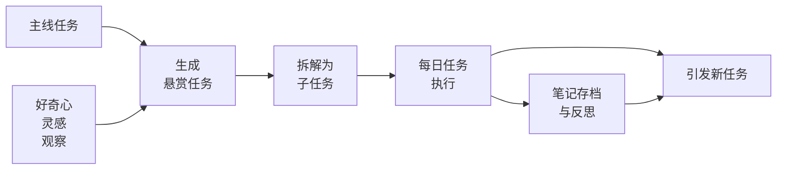

- [[#一、为什么需要一个任务系统|一、为什么需要一个任务系统]]
- [[#二、任务系统的构成|二、任务系统的构成]]
	- [[#二、任务系统的构成#主线任务：以终为始|主线任务：以终为始]]
	- [[#二、任务系统的构成#限时任务：带有 DDL 的负债|限时任务：带有 DDL 的负债]]
	- [[#二、任务系统的构成#悬赏任务：探索发现|悬赏任务：探索发现]]
	- [[#二、任务系统的构成#每日任务：从任务库中抽卡|每日任务：从任务库中抽卡]]
	- [[#二、任务系统的构成#任务分级|任务分级]]
	- [[#二、任务系统的构成#（可选）经验值系统|（可选）经验值系统]]
- [[#三、任务的生命周期|三、任务的生命周期]]
- [[#四、注意异化|四、注意异化]]
- [[#尾声|尾声]]

### 一、为什么需要一个任务系统

> 经常忘记 ddl？灵感和疑惑转瞬即逝？面对困难任务失去动力？一周下来感觉什么都没有做？

一个好的任务系统不仅能帮我们规划每天的事务，还能调动做事的积极性。它可以实现以下功能：
- **规划并复盘**：明确每天的 To Do，并在完成后总结反思。
- **有序推进**：管理具有 ddl 的硬性任务。
- **记录灵感**：收集探索过程中的随机问题与兴趣点。
- **增加激励**：将任务拆解并结构化地表示后，每完成一个子任务都能提供激励。

### 二、任务系统的构成

通过整理其他人的经验，我目前的任务库由三种任务组成：主线任务、限时任务、悬赏任务。每种任务可以划分为更细致的子任务。每日任务从任务库中抽取子任务而形成，完成子任务后应整理为笔记，积累知识和见解。

#### 主线任务：以终为始

主线任务代表长期目标或个人愿景，具有显著意义，通常是模糊而遥远的。主线任务应被拆解为下面几种小型任务，否则以我们日常携带的能量面对如此庞然大物，只能望而兴叹、踟蹰不前。

> 在塞尔达传说旷野之息中，林克的目标是打倒盖侬，但这个任务需要找回记忆、解放四神兽、完成若干神庙和支线强化自身，才能逐步接近。

建立主线任务列表可以帮助以终为始，时刻提醒自己的身份。*~~（是海拉鲁的勇者，不是盘踞在大陆的流氓）~~*

#### 限时任务：带有 DDL 的负债

如课程作业、开发任务等，若未按时完成会带来显著损失。它们类似于资产负债表中的“负债”项，需要优先处理。可设立提醒机制，嵌入每日任务中，并通过任务复盘确保进度。

#### 悬赏任务：探索发现

悬赏任务大部分源于好奇与探索，它们没有 ddl，但在解决后能提升某方面的理解和能力，是推动自我成长的关键动力。

> [!NOTE] 原则 1：以问题导向而非事务导向
> 比如任务应该写成 “为什么可以只用 one bit 进行 teleportation？” 而不是 “阅读 one-bit teleportation 文献”。

一方面，问题导向才是最高效的学习方式：前面的表达本身蕴含了探索的意图。在提问时会想到 “怎么从原本的 2-bit 减少一个？”、“这样的简化是否有代价？” 。带着这些疑问去读文献能激发主体性的思考，还可能引出更多相关的悬赏任务。后面的表达显得需要死板地、从头到尾地读论文，这样会陷入被动阅读的状态、为读而读，难以产生收获。

另一方面，两种表达导致的任务积极性有很大差距：

> 我们不希望一打开游戏地图，面对的是一堆机械的问号与叹号，然后像打卡一样一个个清掉，这样和日常上班没什么差别。在旷野之息中，我们打开地形图或站在高地俯瞰时，注意力自然会被那些**看上去 “很有意思”** 的地形和建筑所吸引，也许是几棵排列奇特的树，或是一个怪物营地。它们引发的是 “这几棵树为什么长得这么像？”、“营地里面的宝箱放了什么？” 的自然好奇，而不是 “清理这片区域” 的任务，甚至途中会被意料之外的事件吸引。正是这种**非线性探索**给人深度沉浸与正反馈。

设立任务也是同理。==转变做任务的视角：不是有这这么多不得不完成的工作，而是有这么多可以探索的有趣地方。==

**悬赏任务可以继续拆解为子任务**。子任务不必一口气完成，很多时候在推进过程中会对整个问题有新的理解，甚至孕育出新的探索方向。

#### 每日任务：从任务库中抽卡

> [!NOTE] 原则 2：每晚睡前从任务库中挑选子任务构建第二天的 To Do

这样不会错过限时任务的 ddl，也可以对悬赏任务的内容有一个掌控。

> 林克在卓拉领地就优先做领地相关的任务，其他区域的任务可以先放一放。

> [!NOTE] 原则 3：及时将子任务中获得的新理解和收获记录为笔记

目的很明确，及时将子任务存档，以便于未来完成更大更困难的任务。

> 我们希望将探索时得到的道具存在背包里，而不是拿一把武器丢一把武器。

#### 任务分级

除了按重要性分级外，还有一个经常被忽略的维度是**能量等级**。对于我来说：
- 高能量等级：推公式、写论文、发散思考
- 中能量等级：读论文、看代码、记笔记
- 低能量等级：写代码、任务规划

#### （可选）经验值系统

为子任务分配经验值，是一种人为强化的奖励机制。如果觉得设立的子任务比较难，或者个人的行动力（能量值）比较低，可以试着用这种方式量化进步、提高积极性，也有助于每天的复盘。

如果已经可以在做任务中获得足够的乐趣和动力，那就没必要再使用了。

> 练习风弹、盾挡重置、花式虐猪猪已经足够有趣，就不需要有等级系统刺激多马鞍了。

### 三、任务的生命周期

两种生成悬赏任务的方式分别对应：
- 自上而下的目标驱动
- 自下而上的好奇驱动

无关于产生方式，任务后续的生命周期是相同的，即拆解目标 -> 执行并归档 -> 引发新任务。

### 四、注意异化

> *“工具一旦不再为人所用，就会异化为 ’制度性他者‘ 。”*

如果过度执着于系统本身，或过分强调任务的结构化，就容易本末倒置，陷入另一种形式的机械劳动。

- 原本是为了深入理解一些概念而设立的任务，最后却只是在“打卡完成”，对概念本身反而失去了兴趣；
- 拆解模糊问题、结构化任务生命周期有助于掌控进度，但如果把每一步都定死，就扼杀了探索的自由度，好奇心可能来自于任何阶段。

**不要把手段（建立“金碧辉煌”的任务系统）当成目的，也不要把结果（完成任务的数量）当成目的。** 类比于学习一门课，不要把笔记和考试成绩当作优化目标。

### 尾声

一个好的任务系统，不是为了让我们成为效率机器，而是为了让我们更自由地探索世界、更真诚地面对自己。

它像是一幅尚未完成的地图，既帮我们标记路径，也刺激我们在行进过程找到新的发现。它允许存在空白，允许我们偏离，更允许我们回味之前走过的地方。

每一个被认真完成的子任务、每一个好奇心触发的悬赏任务，都会转化为我们内在认知的一部分 —— 像游戏中解锁的技能、收集的道具，静静地躺在背包里，等待在未来某个时刻派上用场。

> 现在，登上第一座席卡塔吧。
